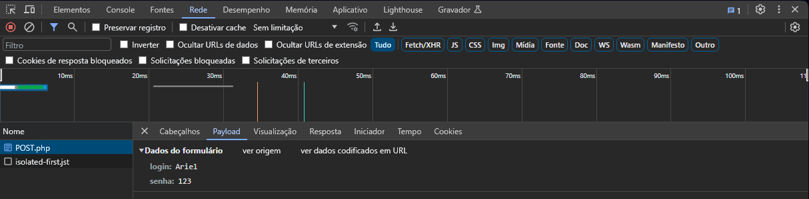

# Métodos GET e POST

## **GET**

Quando utilizamos o GET, os parâmetros são passados no **cabeçalho da requisição**. Por isso, podem ser vistos pela URI.

O seguinte código:
```php
    if(isset($_GET['login'])){
    echo $_GET['login'];
    }
    if(isset($_GET['senha'])){
        echo $_GET['senha'];
    }
```
Retornará o login e a senha na URI: `http://localhost/Lógica%20PHP/Métodos%20GET%20e%20POST/GET.php?login=Ariel&senha=123`.  
O `echo` serve somente para verificar o login e a senha na página HTML.

## **POST**

O POST, ao contrário do GET, envia os parâmetros no corpo da requisição HTTP. Escondendo eles da URI.

O seguinte código:
```php
    if(isset($_POST['login'])){
    echo $_POST['login'];
    
    }
    if(isset($_POST['senha'])){
        echo $_POST['senha'];
    }
```
Não retornará o login e a senha na URI: `http://localhost/Lógica%20PHP/Métodos%20GET%20e%20POST/POST.php`  
O `echo` serve somente para verificar o login e a senha na página HTML.

Então se usarmos o método `POST` protegemos os dados submetidos pelo formulário, já que eles não aparecem na **URI**?

Não. A única coisa que o `POST` faz é enviar os parâmetros no **. Se inspecionarmos a requisição, conseguimos ter acesso a eles:



Se quisermos proteger, de fato, nossa aplicação, precisamos utilizar a "versãos segura" do HTTP, o HTTPS. Com ela, conseguimos criptografar os dados enviados.

## **Diferenças entre GET e POST**

Como o `GET` envia os dados no cabeçalho da requisição, ele tende a ser, não é uma regra, um pouco mais performático que o `POST`.

Porém, por enviar os dados no cabeçalho da requisição, o `GET` tem um tamanho máximo de dados que podem ser enviados, que no geral é de `255` caracteres. Com `POST`, podemos enviar informações maiores, como imagens. Se tentarmos passar uma grande quantidade de informações via `GET`, algumas partes podem ser perdidas no caminho.

As requisições `GET` são recomendadas para obter dados de um determinado recurso. Como em um formulário de busca ou em uma listagem de todos os produtos cadastrados.

Já as requisições `POST` são mais utilizadas para enviar informações para serem processadas, como por exemplo, criar algum recurso, com um produto, ou um cliente.

